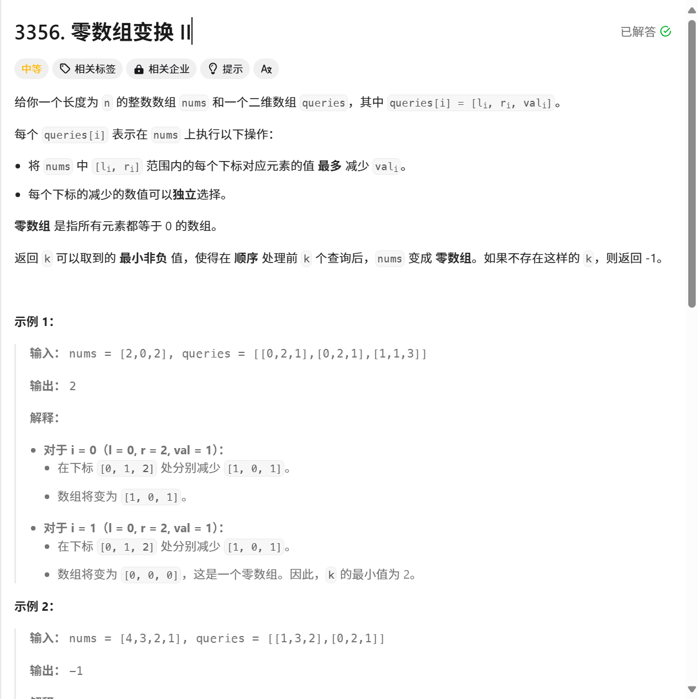

## 基础原理

对于一个数组`arr`它有相对应的差分数组`diff`，有以下关系：

```cpp
diff[0] = arr[0]
diff[i] = arr[i] - arr[i - 1]	i = 1, 2, 3...
```

如果有一个差分数组`diff`也可以通过下面的公式**转换出唯一的原数组`arr`**：

```cpp
arr[0] = diff[0]
arr[i] = arr[i - 1] + diff[i]	i = 1, 2, 3...
或
arr[i] = ∑ diff[i]	i = 0, 1, 2...
```

## 使用场景

当需要对原数组`arr`进行大量区间性的更新时，使用差分数组可以极大的减少时间复杂度

假设我有一个数组`queries`

```cpp
queries[] = [left, right, value]
```

此数组的含义为，我要在原数组起始索引为`left`，结束索引为`right`的区间内的值都进行`value`的更新，如：

```cpp
arr = [2, 0, 2, 5]
queries1 = [1, 3, 2] // 则代表着我要将arr中索引从1到3的数都加2,为
arr = [2, 3, 5, 8]

queries2 = [0, 2, -1] // 则代表着我要将arr中索引为0到2的数都加上-1,为
arr = [1, 2, 4, 8]
```

聪明的你读到这肯定觉得很简单嘛，我们只需要读取`queries[0]`和`queries[1]`获取区间和`queries[2]`获取更新值便可以进行遍历更改，**但是**你有没有想过如果更新区间不是`1-3`和`0-2`这样的小区间，而是跨度足有几百上千并且不只是做一次更新，你又遍历去暴力求值吗？

### 引入差分数组

如果我们将差分数组引入到上面的场景，我们更新就不需要遍历原数组，而是修改差分数组的两个值便可，先说结论：

```cpp
queries[] = [left, right, value]
diff[left] += value
diff[right + 1] -= value
```

更新时，像上式更改差分数组`diff`即可，再根据一个差分数组可以转换出唯一原数组原则，便可得到更新后的原数组

为什么可以这样做呢？

在`arr`中我们修改了`left`到`right`为索引的值，根据差分数组的定义，因为是做差，差分数组从索引`left`到`right`为索引的值是不变的，唯一变的就是索引为`left`和`right + 1`的值，因为这是变化的临界点。

`arr[left]`与`arr[left - 1]`的差值增加了`value`，所以有`diff[left] += value`,

`arr[right + 1]`与`arr[right]`的差值减少了`value`，所以有`diff[right + 1] -= value`。

## 真题实战

多说无益，上题



