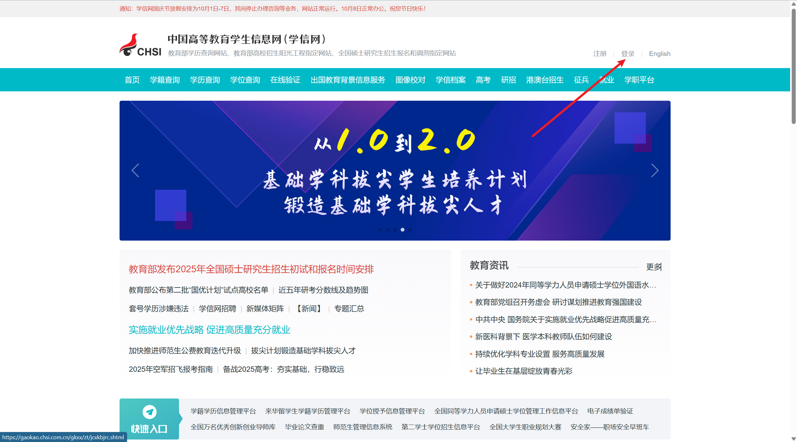
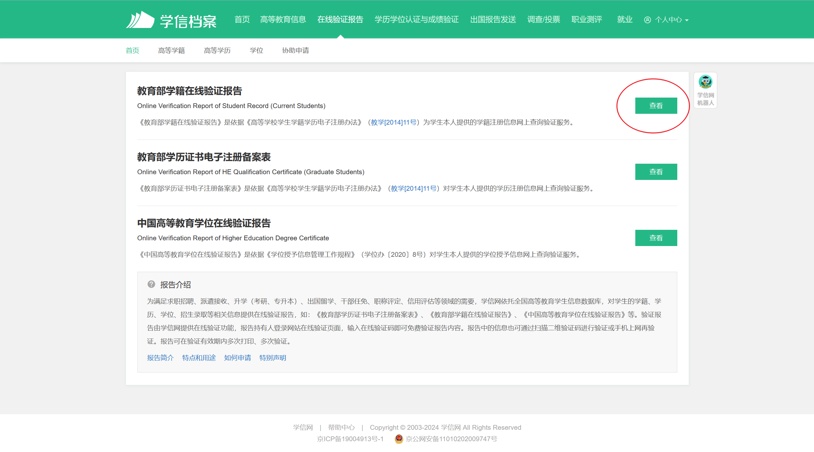
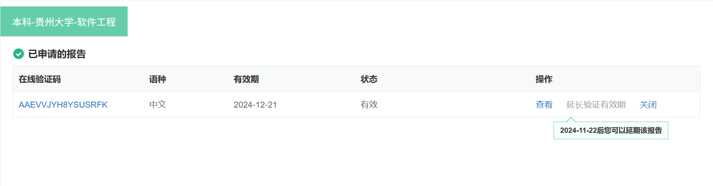
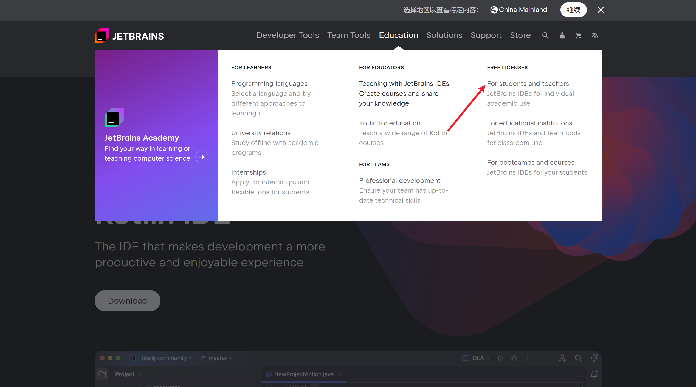
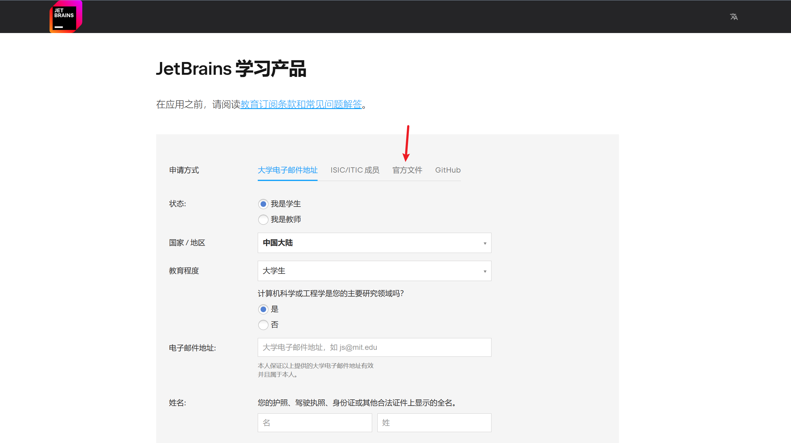
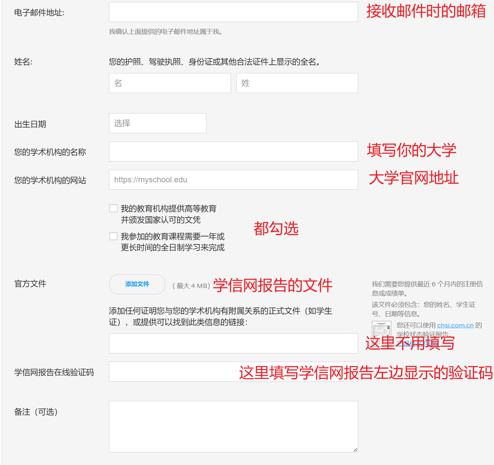

## 1.首先打开学信网

[中国高等教育学生信息网（学信网） (chsi.com.cn)](https://www.chsi.com.cn/)

右上角登陆 没有就注册 绑定个人信息

找到在线验证报告 查看教育部学籍在线验证报告 并将报告下载下来

在线验证码可以保存一下 等下要用 查看后右上角可以保存文件 如果有效期过了就延长

## 2.打开idea官网

[IntelliJ IDEA – the Leading Java and Kotlin IDE (jetbrains.com)](https://www.jetbrains.com/idea/)

然后根据红色箭头点击

进去后往下滑会看到这个按钮

点击Apply now

我们是学信网认证所以点击官方文件，当然如果你有大学邮箱，可以点击第一个。

把光标点击到上一行可查看网址

## 3.等待邮件

填写好申请后只需要等待几天就会收到邮件 就像这样

我们只需要关注邮件里的这一行

点击那个链接 如果你有账号就直接右上方那块登录 没有的话就下方注册 然后就完成啦！

值得一提的是，不仅仅是idea，所有的JetBrains tools你都可以使用**此账号**免费使用 比如PyCharm,DataGrip

好啦 快去使用idea码下你的第一行代码吧
