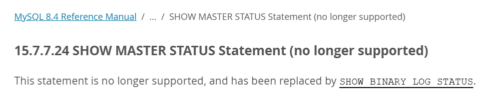

## 为什么使用主从复制
当数据和业务量逐渐变大，一个数据库服务器会显得力不从心，写操作和读操作都在一个数据库上进行，如果某个写操作比较长导致锁表，会严重影响数据的查询。
并且一个数据库来存储数据有很大的安全隐患，当数据库服务器挂掉便致使整个服务的瘫痪，丢失大量数据。
并且可以实现读写分离，大大加快数据的读写以及减轻单个数据库的压力。

所以我们可以使用多个数据库服务，实现主从复制，使得数据得到实时备份，而且一个数据库服务挂掉，可以切换其他的数据库服务继续工作。

---

## 主从复制的原理
主库开启二进制目录后，会有一个**binlog dump线程**读取二进制目录`binlog`中的内容，并发送`binlog`日志的内容到每个从库上。

从库会有一个**I/O线程**接收主库发送的`binlog`日志内容，然后存入本地的`relaylog`日志及中继日志中。

从库还有一个**sql线程**会读取中继日志中的内容，将其解析为具体的增删改并执行，从而使得数据得到了同步。

---

## 实现主从绑定
首先需要主库以及从库，我就以一主一从实现读写分离示例。使用的是MySQL 9.3.0

### 配置主库
我们需要配置MySQL，设置每个主库的唯一标识并开启binlog日志让从库读取信息。

打开配置文件（/etc/my.cnf），添加以下内容：

```title="my.cnf"
[mysqld]
server-id = 1           # 设置主库id为1，使各数据库id不同即可 # [!code ++]
log-bin = mysql-bin     # 启用二进制目录并指定日志路径 # [!code ++]
# binlog-do-db = test     设置只记录test库的日志
# binlog_format = ROW     推荐ROW格式（基于行的复制，更安全）
# expire_logs_days = 7    binlog保留7天（避免占满磁盘）
```

配置要**重启MySQL服务后生效**。

然后需要在主库中创建一个用于复制的账户：

```sql
-- 创建同步账号（允许从库IP访问，%表示所有IP，生产环境建议指定具体IP）
CREATE USER 'user_name'@'%' IDENTIFIED BY 'user_password';

-- 授予复制权限
GRANT REPLICATION SLAVE ON *.* TO 'user_name'@'%';

-- 刷新权限
FLUSH PRIVILEGES;
```

创建完成账户后，我们需要查看二进制日志的**文件名**及**位置**，需要在从库中使用。

import { Aside } from 'astro-pure/user';

<Aside>
这里有一个需要注意的点，其他的教程都比较老所以使用的MySQL版本都比较低，你在其他地方看到基本都是`SHOW MASTER STATUS;`指令。

但是它在MySQL 8.4 中便不再支持，取而代之的是`SHOW BINARY LOG STATUS;`。


所以使用各个技术之前一定注意版本的更迭，阅读官方文档是个不错的习惯。
</Aside>

```sql
-- 查看二进制日志
SHOW BINARY LOG STATUS;
```

返回结果如下，我们需要记住 `File` 和 `Position` 字段的内容。

```plaintext
+------------------+----------+--------------+------------------+-------------------+
| File             | Position | Binlog_Do_DB | Binlog_Ignore_DB | Executed_Gtid_Set |
+------------------+----------+--------------+------------------+-------------------+
| mysql-bin.000001 |      158 |              |                  |                   |
+------------------+----------+--------------+------------------+-------------------+
1 row in set (0.010 sec)
```

### 配置从库
打开配置文件（/etc/my.cnf）添加以下内容：

```title="my.cnf"
[mysqld]
server-id = 2               # 设置从库id为2，使各数据库id不同即可 # [!code ++]
relay-log = mysql-relay-log # 从主库上同步日志文件到本地 中继日志 # [!code ++]
read-only = 1               # 从库设置为只读，避免直接写从库 # [!code ++]
```

重启MySQL服务。

然后在从库上配置要复制的主库信息。

<Aside>
你可能会在其他较老的教程中看到下面的指令，但它在MySQL 8.0.23 被 `CHANGE REPLICATION SOURCE TO` 取代。

```sql
change master to 
  master_host = 'host_name',
  master_port = 3306,
  master_user = 'replication_user_name',
  master_password = 'replication_user_password',
  master_log_file = 'recorded_log_file_name',
  master_log_pos = recorded_log_file_position;
```
</Aside>

```sql
CHANGE REPLICATION SOURCE TO
  SOURCE_HOST = 'host_name',
  SOURCE_USER = 'user_name',
  SOURCE_PASSWORD = 'password',
  SOURCE_PORT = port_num,
  SOURCE_LOG_FILE = 'source_log_name',
  SOURCE_LOG_POS = source_log_pos,
  SOURCE_SSL=0,
  GET_SOURCE_PUBLIC_KEY=1;
```

添加`SOURCE_SSL=0,GET_SOURCE_PUBLIC_KEY=1;`防止出现 [`Authentication requires secure connection.`](#常见问题)报错，配置好后启动主从复制服务。

```sql
START REPLICA;
```

查看主从复制的状态，可以在命令后加`\G`将表格竖着展示更好查看。

```sql
SHOW REPLICA STATUS;
```

可以看到很多信息，如果连接出错可以查看`Replica_IO_State`和`Last_IO_Error`字段，根据具体错误做出解决手段。

重点查看这两个线程状态

```plaintext
 Replica_IO_Running: Yes
Replica_SQL_Running: Yes
```

如上同为**Yes**，才为配置成功。

---

## 常见问题

### Authentication plugin 'caching_sha2_password' reported error: Authentication requires secure connection.

这个错误的原因是是因为MySQL 8.0 起默认使用 `caching_sha2_password` 密码验证方式。

**方法一：** 修改master库中用于复制账户的加密方式为 `mysql_native_password`：

1. 登录 MySQL 服务器，并进入数据库。
2. 运行以下命令来修改从库的密码验证方式：

```sql
ALTER USER 'user_name'@'%' IDENTIFIED WITH mysql_native_password BY 'user_password';
```

**方法二：** 配置主从复制时添加参数`SOURCE_SSL=0,GET_SOURCE_PUBLIC_KEY=1;`
```sql
CHANGE REPLICATION SOURCE TO
  SOURCE_HOST = 'host_name',
  SOURCE_USER = 'user_name',
  SOURCE_PASSWORD = 'password',
  SOURCE_PORT = port_num,
  SOURCE_LOG_FILE = 'source_log_name',
  SOURCE_LOG_POS = source_log_pos,
  SOURCE_SSL=0, # [!code ++]
  GET_SOURCE_PUBLIC_KEY=1; # [!code ++]
```

**方法三：** 配置SSL等信息使用安全连接（生产环境推荐），具体可参考官方文档：[MySQL 9.3 Reference Manual - 15.4.2.2 CHANGE REPLICATION SOURCE TO Statement](https://dev.mysql.com/doc/refman/9.3/en/change-replication-source-to.html)

**原理解析**
1. 默认情况下，MySQL 8.0.4 版本开始，MySQL 使用了 `caching_sha2_password` 密码验证方式，该方式在安全性上有所提升。
2. `caching_sha2_password` 密码验证方式要求客户端和服务器都使用 TLS/SSL 连接。系统状态变量Rsa_public_key，此值是sha256_password身份验证插件用于RSA密钥对的密码交换的公用密钥 。
 - 如果连接安全（TLS/SSL），则无需使用RSA密钥对。使用TLS的加密连接，客户端将密码经 `SHA-256` 哈希后传输，服务器对比存储的哈希值，验证通过即可。
 - 如果连接不安全（无SSL），服务器需先向客户端发送 RSA 公钥 → 客户端用公钥加密密码后传输 → 服务器用私钥解密并验证（这也是前文 GET_SOURCE_PUBLIC_KEY 参数的核心应用场景）。。
 - 如果连接既不安全也没有RSA密钥对，则无法连接。

所以原因就是我们的连接既不安全也没有RSA密钥对，所以主库拒绝了连接。所有可以通过修改验证插件（方法一）和不使用SSL而添加RSA密钥对来解决（方法二）。

- **GET_SOURCE_PUBLIC_KEY：**
  启用基于 RSA 密钥对的密码交换机制，通过向主库（source）请求公钥实现。该选项默认禁用（默认值为 0）。
- **SOURCE_SSL：**
  指定从库（replica）是否对主从复制连接进行加密。默认值为 0，表示从库不加密复制连接；若将该参数设为SOURCE_SSL=1，则可通过SOURCE_SSL_xxx和SOURCE_TLS_xxx系列参数进一步配置加密规则（如 SSL 版本、证书路径等）。
- 更多参数配置，请参考官方文档：[MySQL 9.3 Reference Manual - 15.4.2.2 CHANGE REPLICATION SOURCE TO Statement](https://dev.mysql.com/doc/refman/9.3/en/change-replication-source-to.html)